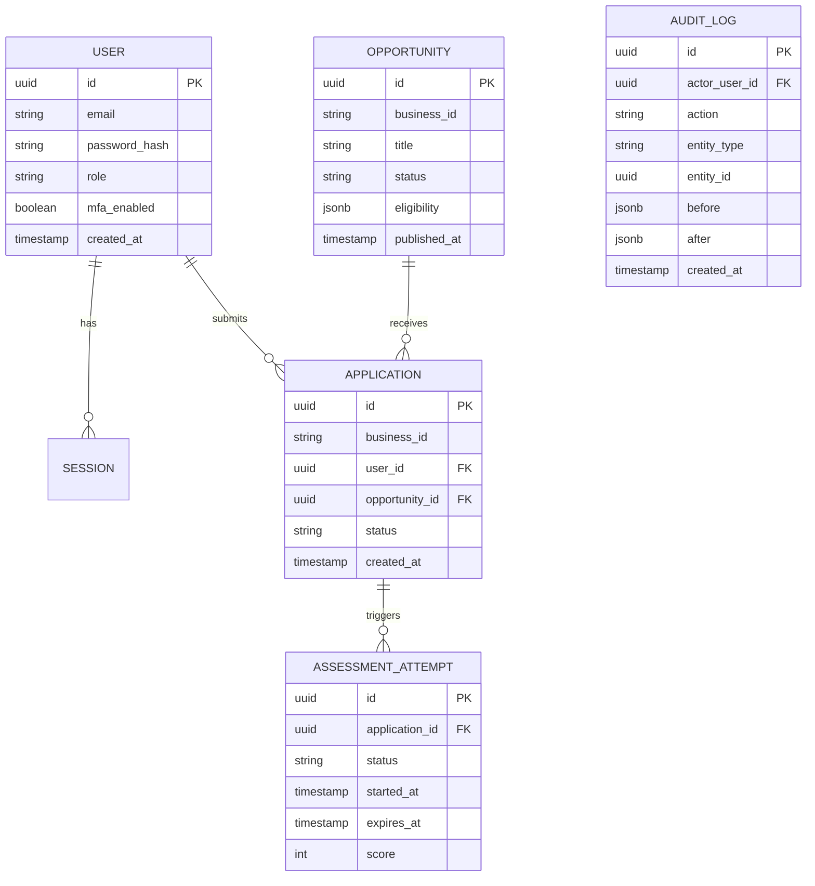

# Portal Architecture — Phase 0

## 1. Current state (existing repo, before this phase)

- **What it is**: `inveontechnologies-website` is a static marketing site — React 18 + Vite + TypeScript, Tailwind, Radix UI, `wouter` for routing. No backend, no database, no auth.
- **Build**: multi-stage `Dockerfile` — `pnpm install && pnpm run build` in a Node 20 Alpine build stage, then the static output is copied into an `nginx:1.27-alpine` image and served.
- **Deployment**: `docker-compose.yml` runs one `web` service (this nginx image) plus a `certbot` sidecar for Let's Encrypt renewal, on ports 80/443. `web` is also attached to an **external** network, `crm_crm_network`, meaning it already shares a Docker network with another stack (the CRM) that is *not* defined in this compose file — that stack is managed separately.
- **nginx config** (`nginx/inveontechnologies.in.conf`) is the single shared reverse proxy for the whole domain. It already terminates TLS and routes for four subdomains: `inveontechnologies.in` (this static site), `mail.inveontechnologies.in` (proxies to `host.docker.internal:8080`), `crm.inveontechnologies.in` (proxies to `crm_frontend:3000`), and `api.inveontechnologies.in` (proxies `/api/`, `/socket.io/`, `/uploads/` to `crm_backend:5000`).
- **Payment scaffold**: `server/cashfree-example.ts` exists as a reference-only example, not wired into a running backend.

## 2. Gap analysis against the portal requirements

| Area | Exists today | Gap |
|---|---|---|
| Auth / sessions | None | Full auth module needed (Phase 1) |
| Database | None | Postgres + migrations needed |
| API layer | None | New `portal-backend` service needed |
| File storage | None | Private object storage + signed URLs (later phase) |
| Payments | Reference file only, unused | Real Cashfree integration (Phase 5) |
| Email | None | Mailcow adapter (Phase 9) |
| Roles/permissions | None | Role + permission matrix (this phase, doc only) |
| Deployment routing | Pattern exists for CRM (`crm.` / `api.` subdomains) | Extend same pattern to `portal.` |

## 3. Target architecture (Phase 0 skeleton)

```
inveontechnologies-website/
├── src/                    # existing marketing site — untouched
├── portal-frontend/        # NEW — candidate/employee-facing portal UI
│   ├── src/
│   ├── Dockerfile
│   └── package.json
├── portal-backend/         # NEW — modular monolith API
│   ├── src/
│   │   ├── modules/
│   │   │   ├── auth/
│   │   │   ├── opportunities/
│   │   │   ├── applications/
│   │   │   ├── assessments/
│   │   │   └── shared/       # db client, logger, error handling, middleware
│   │   ├── migrations/       # empty placeholder for Phase 1
│   │   └── index.ts          # server entrypoint + health check
│   ├── Dockerfile
│   └── package.json
├── docs/                   # this folder
├── docker-compose.yml      # extended with portal-frontend + portal-backend
└── nginx/inveontechnologies.in.conf   # extended with portal.inveontechnologies.in
```

`portal-backend` is a **modular monolith**: one deployable process, but each business area is an isolated module with its own routes/services/repository, communicating only through explicit exports — not one giant shared file. This makes a future split into separate services mechanical rather than a rewrite, without paying microservice operational cost now.

## 4. High-level ER diagram (Phase 1–2 scope only — payments/employees/etc. come later)



## 5. API conventions

- Base path: `https://portal.inveontechnologies.in/api/v1/...`
- Auth: `Authorization: Bearer <access_token>`; refresh via `POST /api/v1/auth/refresh` (rotates refresh token).
- Errors: consistent JSON shape `{ "error": { "code": "STRING_CODE", "message": "human readable", "requestId": "uuid" } }`.
- Pagination: cursor-based, `?cursor=...&limit=...`, response includes `nextCursor`.
- Idempotency: mutating POSTs that trigger side effects (applications, payments later) accept an `Idempotency-Key` header.
- Every request gets a `X-Request-Id` (generated if not supplied) that's included in logs and error responses for traceability.

## 6. Environment matrix

| Variable | Dev | Staging | Prod | Notes |
|---|---|---|---|---|
| `PORTAL_DATABASE_URL` | local Postgres | staging Postgres | prod Postgres | never committed |
| `PORTAL_JWT_SECRET` / `PORTAL_REFRESH_SECRET` | dev-only value | unique | unique, rotated | never committed |
| `PORTAL_CORS_ORIGIN` | `http://localhost:5173` | `https://staging-portal...` | `https://portal.inveontechnologies.in` | |
| `PORTAL_PORT` | 4000 | 4000 | 4000 | internal container port |
| `NODE_ENV` | development | staging | production | gates verbose logging/errors |

`portal-backend` validates all required env vars at startup and fails fast with a clear error rather than starting in a broken state.

## 7. Threat model (Phase 0 summary — expanded per-phase)

- **Auth**: brute force → rate limiting + lockout; session theft → short-lived tokens + rotation + revoke-all-sessions.
- **Authorization**: never trust frontend role claims — every mutating endpoint re-checks role/permission server-side against the DB.
- **Data**: personal candidate data (email, phone, documents later) — classified sensitive; encrypted at rest once file storage is added; never logged in plaintext.
- **Injection**: parameterized queries only via the ORM/migration tool; no raw string SQL concatenation.
- **Transport**: TLS terminated at the shared nginx layer (already in place); internal container traffic stays on the Docker network.

## 8. What this phase deliberately does NOT include

No business logic, no real database connection wired up, no auth implementation, no payment code. This is structure + docs only, per the plan's own Phase 0 instruction ("do not implement feature code yet").
