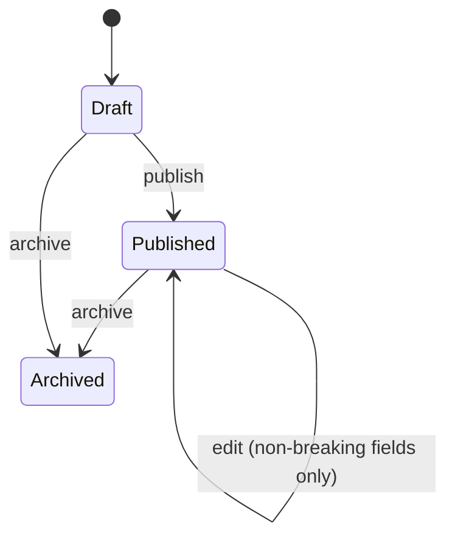
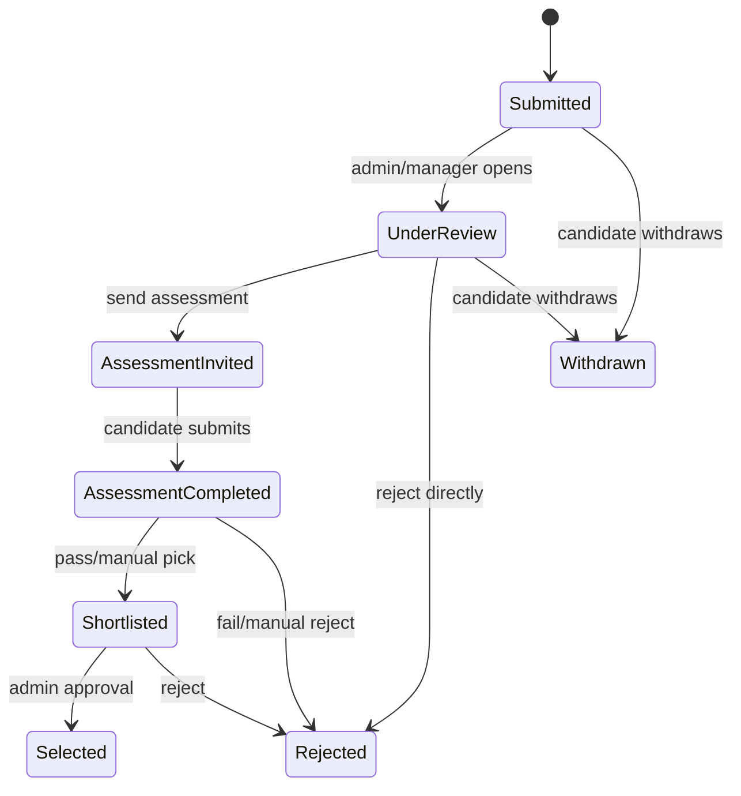
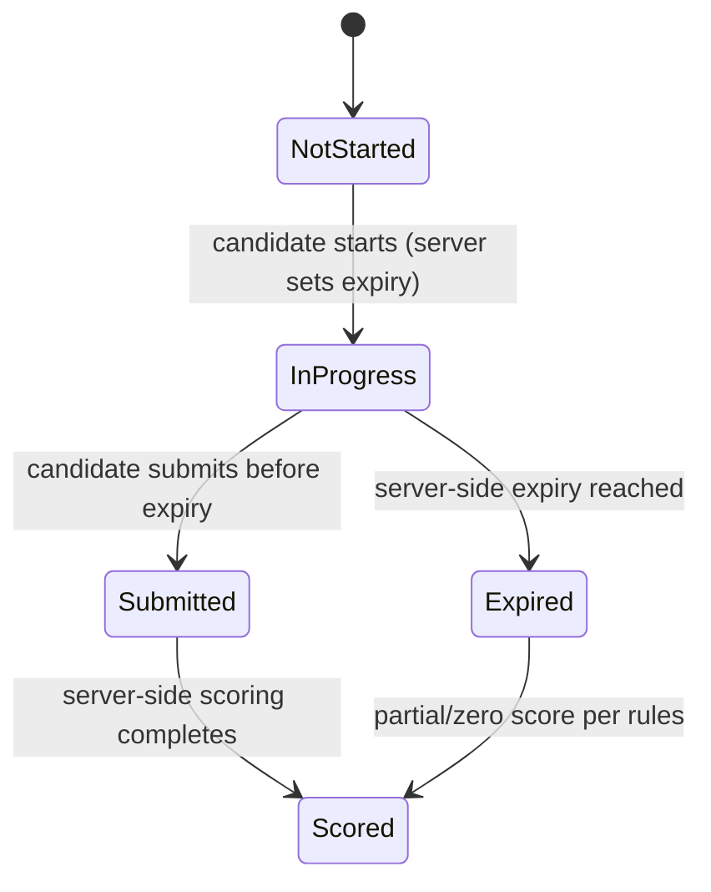

# State Machines — Phase 0 (MVP scope)

Only the entities in scope for the initial release (see `decisions.md` #1) are defined here. Payment, employee-lifecycle, and course/certificate state machines will be added in their own phases.

## Opportunity

## Application

## Assessment attempt

## Rules that apply across all three

1. Transitions are enforced **server-side only** — the API rejects any transition not in this table, regardless of what the client sends.
2. Every transition writes an audit log entry (`actor`, `from`, `to`, `timestamp`, `reason` where applicable).
3. Terminal states (`Archived`, `Rejected`, `Selected`, `Withdrawn`, `Scored`) are not re-openable through normal API calls — only through an explicit, audited admin override, if that's ever needed.
