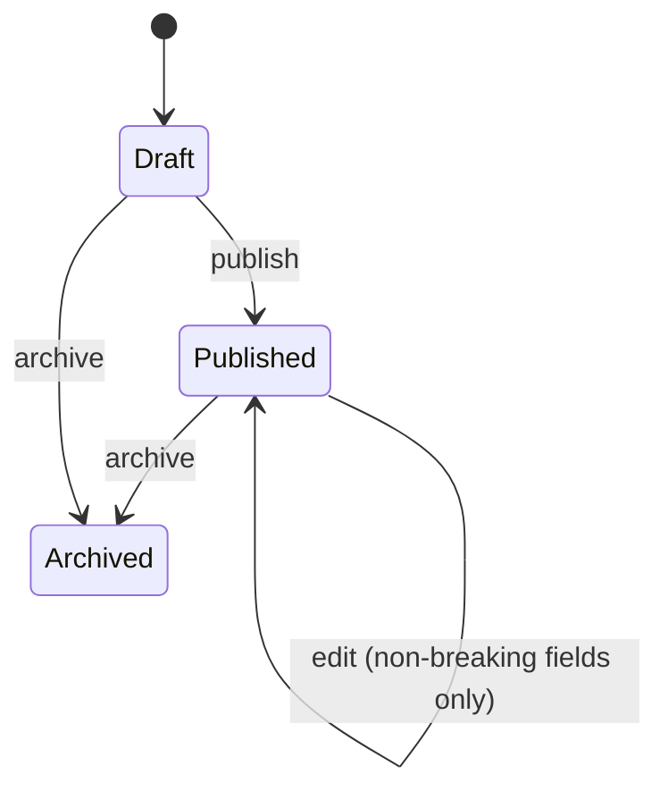
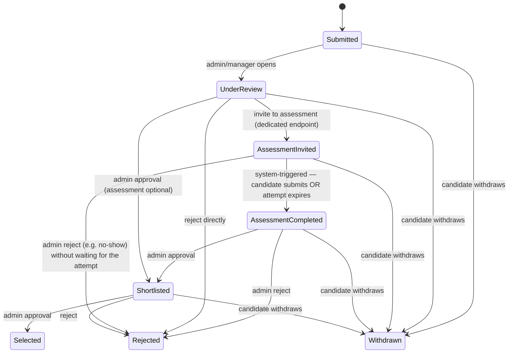
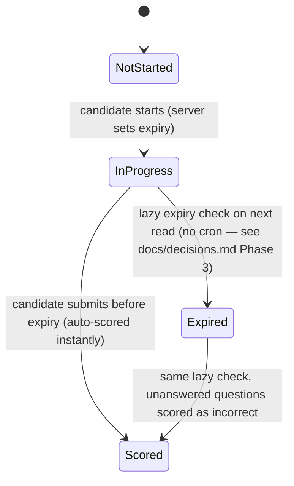

# State Machines — Phase 0 (MVP scope)

Only the entities in scope for the initial release (see `decisions.md` #1) are defined here. Payment, employee-lifecycle, and course/certificate state machines will be added in their own phases.

## Opportunity

## Application

**Implemented in `applications/state-machine.ts`** as three explicit transition tables — admin, candidate, and system — rather than one shared table, because each has a different actor and different validity rules:
- **Admin transitions** (`isAdminTransitionAllowed`): used by the generic `/applications/:id/transition` endpoint. Notably this table does *not* allow moving directly into `AssessmentInvited` or `AssessmentCompleted` from that generic endpoint — those have side effects (creating an attempt; requiring a resolved score) that the generic endpoint doesn't know how to produce.
- **Candidate transitions** (`isCandidateTransitionAllowed`): only ever `-> Withdrawn`, from any non-terminal state.
- **System transition** (`isSystemTransitionAllowed`): exactly one — `AssessmentInvited -> AssessmentCompleted` — fired by `assessments/attempt-routes.ts` when a candidate submits or an attempt lazily resolves as expired. Kept separate from the admin table so it's obvious at the call site that this isn't a privilege-checked action.

## Assessment attempt

**Implemented note**: the `submitted` status in `assessment_attempt_status` (schema.ts) is reserved but currently unreachable as a *persisted* state — Phase 3 is MCQ-only and auto-scored, so submit and score happen atomically in one request with no gap for `submitted` to be observed on its own. It's there for a future manual-grading phase (free-text questions) where "submitted, awaiting a human grader" is a real, potentially long-lived state.

## Rules that apply across all three

1. Transitions are enforced **server-side only** — the API rejects any transition not in this table, regardless of what the client sends.
2. Every transition writes an audit log entry (`actor`, `from`, `to`, `timestamp`, `reason` where applicable).
3. Terminal states (`Archived`, `Rejected`, `Selected`, `Withdrawn`, `Scored`) are not re-openable through normal API calls — only through an explicit, audited admin override, if that's ever needed.
