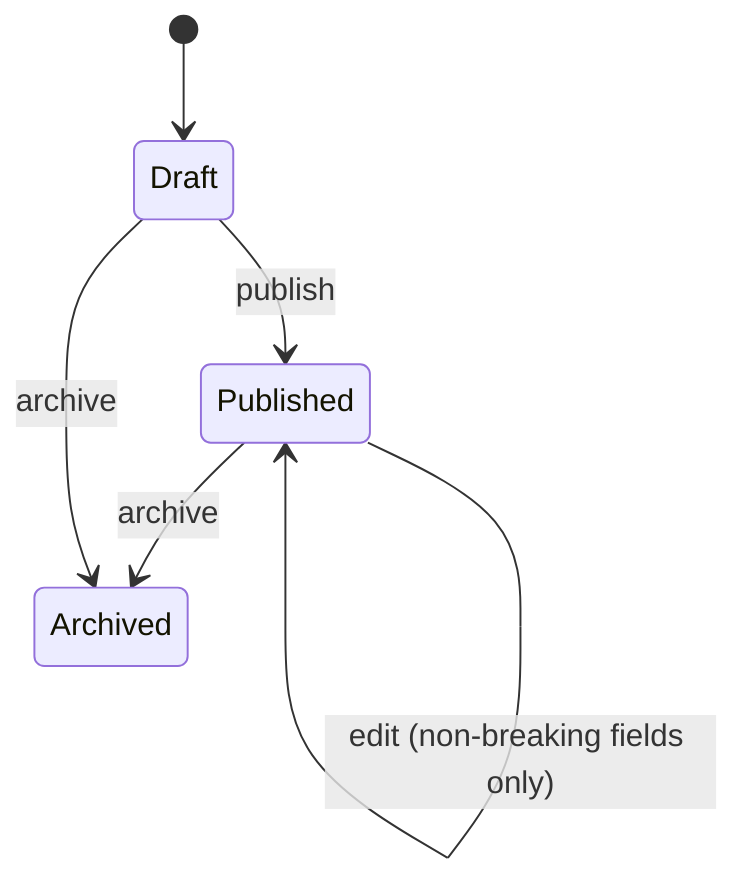
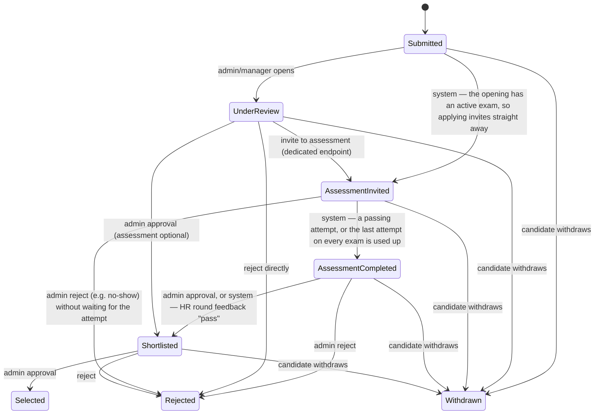
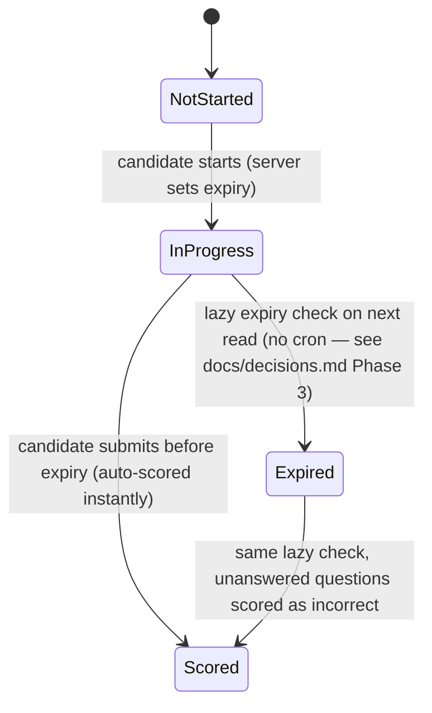
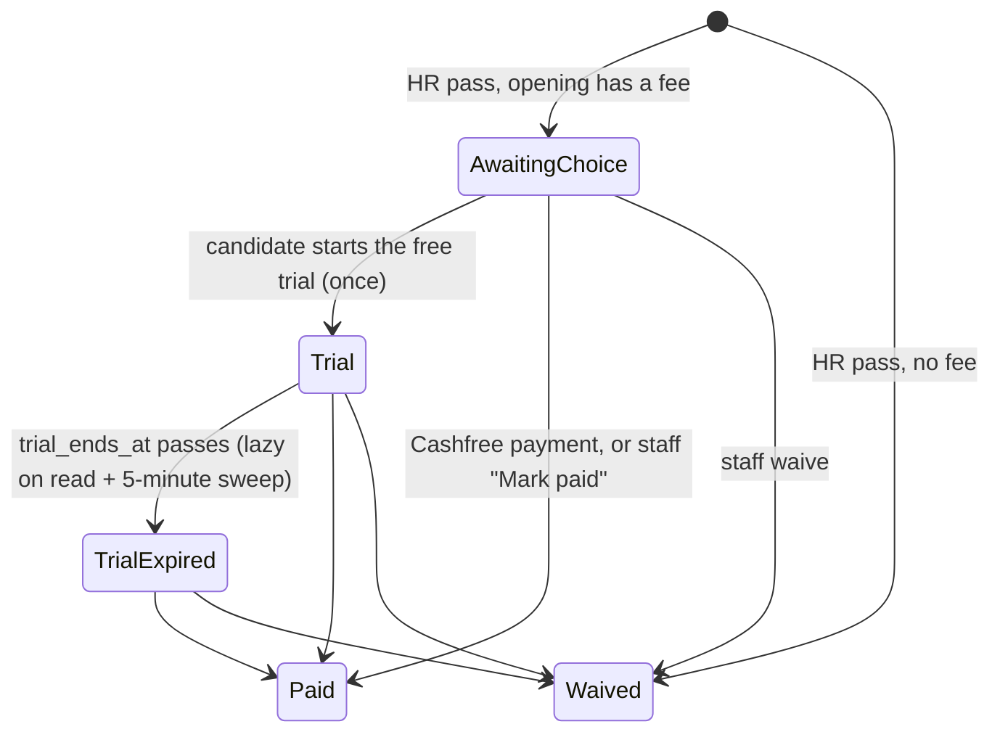

# State Machines — Phase 0 (MVP scope)

Only the entities in scope for the initial release (see `decisions.md` #1) are defined here. Payment, employee-lifecycle, and course/certificate state machines will be added in their own phases.

## Opportunity


```mermaid
stateDiagram-v2
    [*] --> Draft
    Draft --> Published: publish
    Published --> Archived: archive
    Draft --> Archived: archive
    Published --> Published: edit (non-breaking fields only)
```

## Application


```mermaid
stateDiagram-v2
    [*] --> Submitted
    Submitted --> UnderReview: admin/manager opens
    Submitted --> AssessmentInvited: system — the opening has an active exam, so applying invites straight away
    UnderReview --> AssessmentInvited: invite to assessment (dedicated endpoint)
    AssessmentInvited --> AssessmentCompleted: system — a passing attempt, or the last attempt on every exam is used up
    AssessmentCompleted --> Shortlisted: admin approval, or system — HR round feedback "pass"
    AssessmentCompleted --> Rejected: admin reject
    UnderReview --> Shortlisted: admin approval (assessment optional)
    UnderReview --> Rejected: reject directly
    AssessmentInvited --> Rejected: admin reject (e.g. no-show) without waiting for the attempt
    Shortlisted --> Selected: admin approval
    Shortlisted --> Rejected: reject
    Submitted --> Withdrawn: candidate withdraws
    UnderReview --> Withdrawn: candidate withdraws
    AssessmentInvited --> Withdrawn: candidate withdraws
    AssessmentCompleted --> Withdrawn: candidate withdraws
    Shortlisted --> Withdrawn: candidate withdraws
```

**Implemented in `applications/state-machine.ts`** as three explicit transition tables — admin, candidate, and system — rather than one shared table, because each has a different actor and different validity rules:
- **Admin transitions** (`isAdminTransitionAllowed`): used by the generic `/applications/:id/transition` endpoint. Notably this table does *not* allow moving directly into `AssessmentInvited` or `AssessmentCompleted` from that generic endpoint — those have side effects (creating an attempt; requiring a resolved score) that the generic endpoint doesn't know how to produce.
- **Candidate transitions** (`isCandidateTransitionAllowed`): only ever `-> Withdrawn`, from any non-terminal state.
- **System transitions** (`isSystemTransitionAllowed`): three. The first two live in `assessments/exams.ts`; the third, `UnderReview/AssessmentCompleted -> Shortlisted`, fires in `payments/enrollments.ts` when an interviewer records "pass" on the HR round. That same step creates the candidate's program enrollment (pay the opening's program fee through Cashfree, or start the free trial; no fee means straight to the joining form). `Submitted -> AssessmentInvited` fires when a candidate applies to an opening that has at least one active exam with questions. `AssessmentInvited -> AssessmentCompleted` fires after a scored attempt (submitted or lazily expired) when the attempt passed, or when it failed and no exam on the opening has attempts left. A failed attempt with retries remaining leaves the application in `AssessmentInvited`. Kept separate from the admin table so it's obvious at the call site that this isn't a privilege-checked action.
- **Language exams**: an opening can have several exams (one per language or track), each with its own pass mark and `max_attempts`. The candidate picks one, and passing any one is enough. Attempts are numbered per application (`attempt_number`); an exam with attempts on record can't have its questions edited, and deleting it switches it off instead.

## Assessment attempt


```mermaid
stateDiagram-v2
    [*] --> NotStarted
    NotStarted --> InProgress: candidate starts (server sets expiry)
    InProgress --> Scored: candidate submits before expiry (auto-scored instantly)
    InProgress --> Expired: lazy expiry check on next read (no cron — see docs/decisions.md Phase 3)
    Expired --> Scored: same lazy check, unanswered questions scored as incorrect
```

**Implemented note**: the `submitted` status in `assessment_attempt_status` (schema.ts) is reserved but currently unreachable as a *persisted* state — Phase 3 is MCQ-only and auto-scored, so submit and score happen atomically in one request with no gap for `submitted` to be observed on its own. It's there for a future manual-grading phase (free-text questions) where "submitted, awaiting a human grader" is a real, potentially long-lived state.

## Rules that apply across all three

1. Transitions are enforced **server-side only** — the API rejects any transition not in this table, regardless of what the client sends.
2. Every transition writes an audit log entry (`actor`, `from`, `to`, `timestamp`, `reason` where applicable).
3. Terminal states (`Archived`, `Rejected`, `Selected`, `Withdrawn`, `Scored`) are not re-openable through normal API calls — only through an explicit, audited admin override, if that's ever needed.


## Program enrollment (after the HR round)


```mermaid
stateDiagram-v2
    [*] --> AwaitingChoice: HR pass, opening has a fee
    [*] --> Waived: HR pass, no fee
    AwaitingChoice --> Trial: candidate starts the free trial (once)
    AwaitingChoice --> Paid: Cashfree payment, or staff "Mark paid"
    Trial --> TrialExpired: trial_ends_at passes (lazy on read + 5-minute sweep)
    Trial --> Paid
    TrialExpired --> Paid
    AwaitingChoice --> Waived: staff waive
    Trial --> Waived
    TrialExpired --> Waived
```

Implemented in `payments/`. During a trial the opening's courses are enrolled with `payment_status = pending` and `payment_due_at = trial_ends_at`, so the LMS's existing overdue check pauses them when the trial ends; paying or waiving clears it. A payment is confirmed either by Cashfree's webhook (signature checked over the raw body) or by the return page calling `/program/enrollments/:id/verify`, which reads the order from Cashfree; both are idempotent. The joining form is open once the candidate is on trial, paid or waived.

## Payslip

```
(none) --draft (HR, or the monthly job from PAYROLL_DRAFT_DAY)--> draft
draft  --loss-of-pay change or refresh--> draft (recalculated)
draft  --publish (HR)--> published   (final: emailed to the employee, never edited)
```

Pay for a month = each earning × payable days / days in month, where payable days start at the joining date (if they joined that month) less loss-of-pay days. Deductions are fixed and never exceed what was earned.
